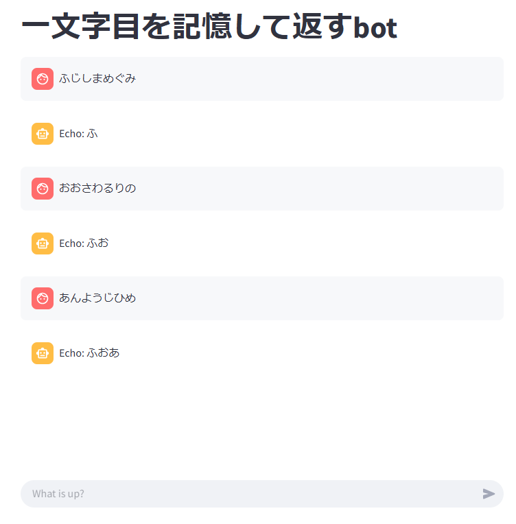

# demo-chat-ui  
ステートマシン型のチャットボットに対して使えるチャットUI。  
  
## 使い方  
パッケージインストール  
```
pip install streamlit
```  
デモ実行(チャットの一文字目を記憶して返すチャットボット)    
```
run_chat_ui.sh
```  

TmpChatBot部分を自作のステートマシン型エージェントに変えれば  
汎用的に使える。  
  


